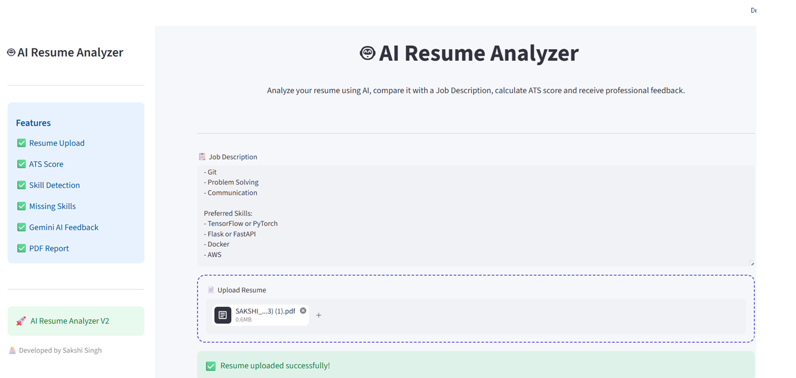
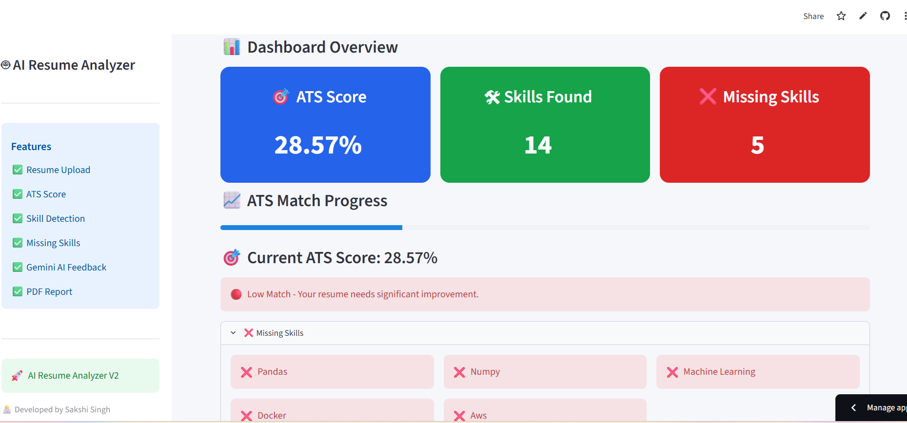
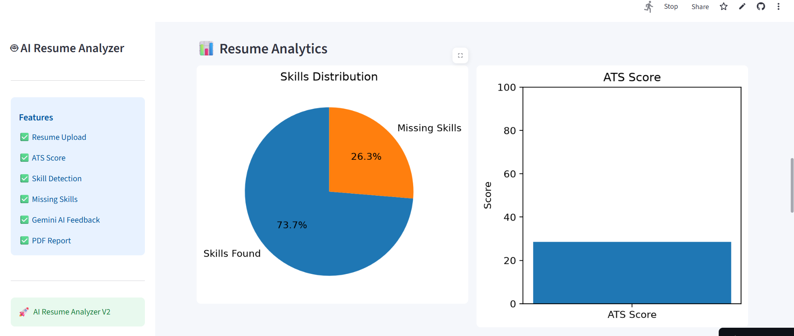
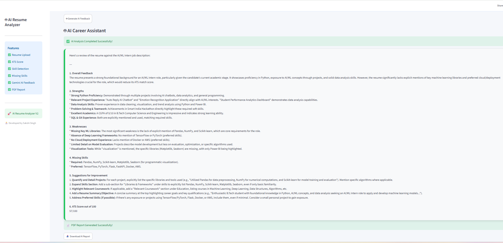
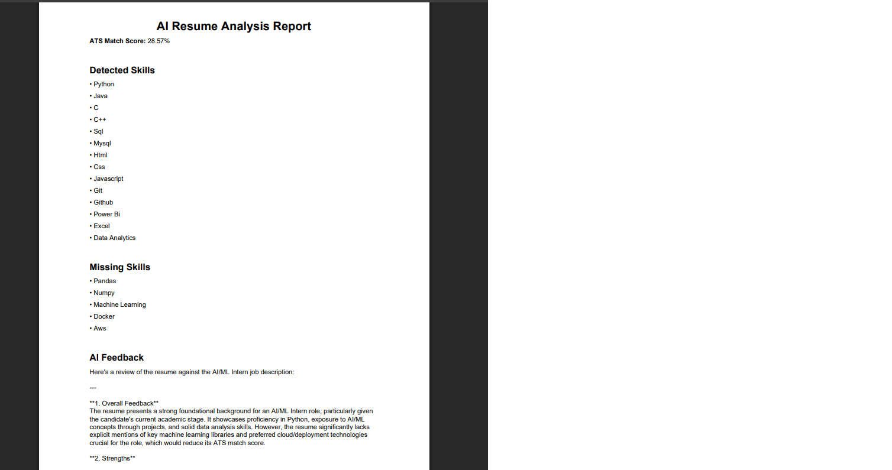

# 🤖 AI Resume Analyzer V2

An AI-powered Resume Analyzer built using **Python, Streamlit, and Google Gemini AI**.

It helps job seekers compare their resume with a job description, calculate an ATS score, identify missing skills, and receive AI-generated suggestions for improvement.

---

## ✨ Features

- 📄 Upload Resume (PDF)
- 📝 Extract Resume Text
- 🛠 Detect Technical Skills
- 🎯 ATS Match Score
- ❌ Missing Skills Detection
- 🤖 AI Resume Feedback (Google Gemini)
- 📊 Interactive Analytics Dashboard
- 📥 Download AI Report (PDF)
- 🎨 Modern Streamlit UI

---

## 🛠 Tech Stack

- Python
- Streamlit
- Google Gemini API
- PyPDF2
- ReportLab
- Matplotlib

---

## 📂 Project Structure

```
AI-Resume-Analyzer/
│
├── app.py
├── analyzer.py
├── ai_helper.py
├── pdf_generator.py
├── requirements.txt
├── README.md
├── .gitignore
└── .env
```

---

## 🚀 Installation

Clone the repository

```bash
git clone https://github.com/yourusername/AI-Resume-Analyzer.git
```

Go to project folder

```bash
cd AI-Resume-Analyzer
```

Create virtual environment

```bash
python -m venv .venv
```

Activate it

Windows

```bash
.venv\Scripts\activate
```

Install dependencies

```bash
pip install -r requirements.txt
```

Run the application

```bash
streamlit run app.py
```

---

## 📷 Screenshots


### 🏠 Home Page



---

### 📊 Dashboard



---

### 📈 Resume Analytics



---

### 🤖 AI Feedback



---

### 📄 PDF Report



---
## 🚀 Live Demo

[🌐 Open AI Resume Analyzer](https://ai-resume-analyzer-gkw2quy4dabwburuwg6ngm.streamlit.app)

## 👩‍💻 Developed By

**Sakshi Singh**

B.Tech Computer Science Engineering

